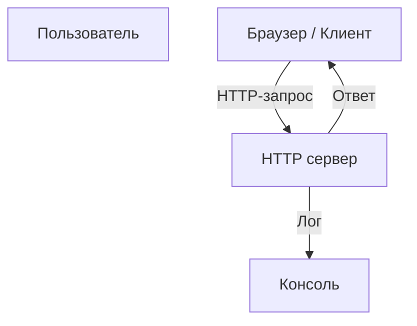

# Минималистичный HTTP сервер на Kotlin

Обеспечивает простой HTTP сервер, который отвечает на все запросы фиксированным сообщением


---

## 📖 О проекте

Данный проект реализует минимальный HTTP сервер на Kotlin с использованием встроенных возможностей платформы. Он слушает порт 8080 и возвращает сообщение "Hello from Kotlin!" при любой HTTP-запросе. Подходит для обучения, тестирования и быстрых прототипов.

Проект демонстрирует базовые навыки работы с сервером, сетевыми соединениями и обработкой HTTP-запросов на Kotlin, без привлечения внешних фреймворков.

## ✨ Функционал

- 💻 Запуск HTTP сервера на порту 8080
- 🌐 Обработка всех входящих запросов и отправка фиксированного ответа
- 🚀 Простая расширяемость под более сложные сценарии
- 🔄 Вывод сообщения о запуске сервера в консоль

## 🛠️ Стек технологий


## 🚀 Установка и запуск

### Системные требования

```markdown
- JDK 17 или выше
- Любая ОС с установленным JDK
```

### Пошаговая инструкция

```bash
# 1. Клонируйте репозиторий
git clone https://github.com/user/kotlin-simple-http.git

# 2. Перейдите в каталог проекта
cd kotlin-simple-http

# 3. Соберите проект с помощью Gradle
./gradlew build

# 4. Запустите сервер
./gradlew run
```

После запуска в консоли появится сообщение:  
`Server is running at http://localhost:8080/`  
Откройте браузер и перейдите на http://localhost:8080/ — вы увидите сообщение "Hello from Kotlin!".

## 💡 Примеры использования

### Отправка запроса curl

```bash
curl http://localhost:8080/
```

Ответ:  
`Hello from Kotlin!`

### В браузере

Перейдите по адресу **http://localhost:8080/** — увидите сообщение на странице.

## 📁 Структура проекта

```
kotlin-simple-http/
├── build.gradle.kts   # Скрипты сборки
├── settings.gradle.kts # Настройки проекта
└── src/
    └── main/
        └── kotlin/
            └── Main.kt  # Основной файл сервера
```

- `Main.kt` содержит весь код для инициализации и запуска сервера  
- `build.gradle.kts` описывает зависимости и конфигурацию сборки

## 🏗️ Архитектура / Диаграмма



## ⚙️ Настройки

В текущей конфигурации порт фиксирован — 8080. Возможна доработка с поддержкой конфигурационных файлов или переменных окружения.

## 🧪 Тестирование

Проект не содержит автоматических тестов. Можно добавить с помощью JUnit или других фреймворков для расширения.

## 🤝 Участие в развитии

```markdown
1. Форкните репозиторий
2. Создайте ветку (`git checkout -b feature/YourFeature`)
3. Сделайте изменения и закоммитьте (`git commit -m 'Добавил новую функцию'`)
4. Запушьте ветку (`git push origin feature/YourFeature`)
5. Создайте pull request
```

---

## ⚠️ Важно

<details>
<summary>📚 Обратите внимание</summary>

Это базовая реализация серверной части для целей обучения и прототипирования. В реальных приложениях рекомендуется использовать фреймворки типа Ktor или Spring Boot для более удобной архитектуры, обработки ошибок и безопасности.
</details>

<!-- readme-ai: b07110eae862cf66c507f1f4527eded426565719 -->