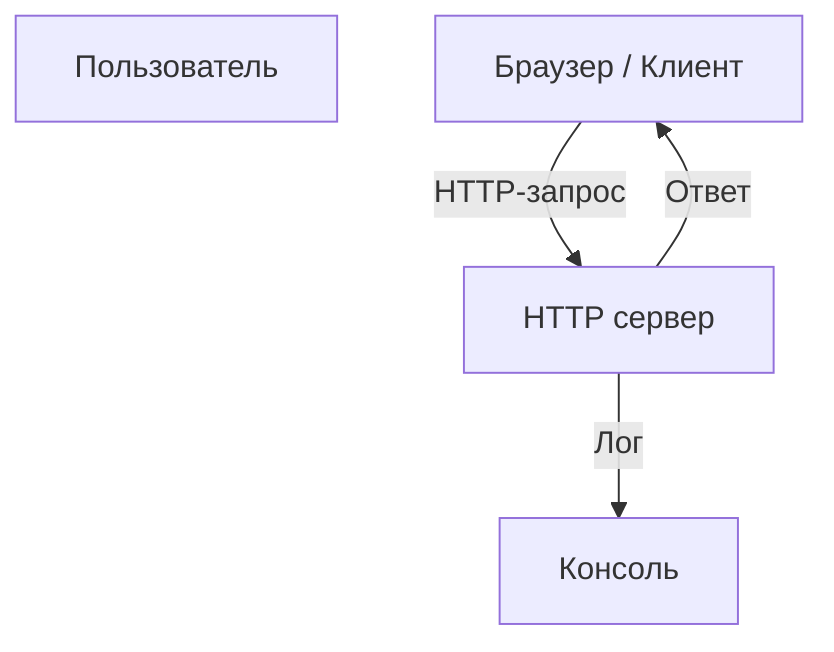

# Simple HTTP Server

Минималистичный HTTP сервер на Node.js, обслуживающий простое текстовое сообщение


---

## 📖 О проекте

Данный проект представляет собой базовый пример HTTP сервера, написанного на Node.js. Он слушает порт 3000 и возвращает простое сообщение "Hello, world!" при любом HTTP-запросе. Такой сервер подходит для учебных целей, тестирования и ознакомления с основами Node.js.

Проект идеально подойдет начинающим разработчикам, желающим понять базовую работу с HTTP и Node.js. Он демонстрирует простую настройку сервера и обработку входящих запросов.

## ✨ Функционал

- 💻 Запуск простого HTTP сервера на порт 3000
- 🌐 Обработка всех входящих запросов и отправка одного сообщения
- 🚀 Легкая расширяемость для более сложных приложений
- 🔄 Автоматический вывод в консоль URL-адреса при запуске

## 🛠️ Стек технологий


## 🚀 Установка и запуск

### Системные требования

```markdown
- Node.js >= 14.x
- Любая операционная система с установленным Node.js
```

### Пошаговая инструкция

```bash
# 1. Клонируйте репозиторий
git clone https://github.com/user/test_readme.git

# 2. Перейдите в папку проекта
cd test_readme

# 3. Установите необходимые зависимости (если есть, в данном случае — нет)
# dependencies отсутствуют, команда опциональна

# 4. Запустите сервер
node index.js
```

После этого в терминале появится сообщение:  
`Server running at http://localhost:3000/`  
Откройте браузер и перейдите на http://localhost:3000/ — вы увидите ответ "Hello, world!".

## 💡 Примеры использования

### Запрос API через curl

```bash
curl http://localhost:3000/
```

Ответ:  
`Hello, world!`

### Пример использования в браузере

Откройте **http://localhost:3000/** — увидеть сообщение на странице.

## 📁 Структура проекта

```
simple-http-server/
├── index.js          # Основной файл сервера
├── package.json      # Зависимости и скрипты
├── .gitignore        # Исключения git
```

- `index.js` содержит всю логику сервера — создание, прослушивание порта и ответ пользователю.
- `package.json` управляет зависимостями (в данном случае — пустой или минимальный).

## 🏗️ Архитектура / Диаграмма



## ⚙️ Конфигурация

Конфигурационных параметров в проекте нет, все настройки фиксированы (порт 3000). Могут быть расширены для поддержки окружений через `.env` или параметры.

```env
PORT=3000
```

## 🧪 Тестирование

Данный проект не содержит автоматических тестов. Для расширения рекомендуется добавить тесты с использованием Mocha, Jest или другого фреймворка.

## 🤝 Участие в разработке

```markdown
1. Форкните репозиторий
2. Создайте ветку (`git checkout -b feature/YourFeature`)
3. Сделайте изменения и закоммитьте (`git commit -m 'Добавил новую функцию'`)
4. Запушьте в удалённый репозиторий (`git push origin feature/YourFeature`)
5. Создайте Pull Request
```

---

## ⚠️ Важно

<details>
<summary>📚 Обратите внимание</summary>

Это базовый пример сервера для обучения. В реальных проектах рекомендуется использовать фреймворки типа Express.js для удобства, а также обрабатывать ошибки и обеспечивать безопасность.
</details>

<!-- readme-ai: aa155b86383b36944416f9e764a869da1e3aab17 -->